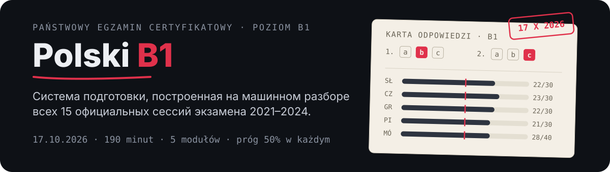

<p align="center">
  
</p>

<p align="center">
  <a href="https://ipostatos.github.io/polski-b1/webapp/">Mini App</a> ·
  <a href="https://t.me/Pl_B1_bot">@Pl_B1_bot</a> ·
  <a href="docs/PROGRAM.md">программа 8 недель</a> ·
  <a href="docs/EXAM_SPEC.md">спецификация экзамена</a>
</p>

Персональная система подготовки к **państwowy egzamin certyfikatowy z języka
polskiego jako obcego, poziom B1 (dorośli)**. Подход обратный учебнику:
не «глава 1 → глава 20», а **реальные экзамены → повторяющиеся навыки →
точечная грамматика → симуляции**.

## Экзамен предсказуемее, чем кажется

Все 15 официальных сессий B1 за 2021–2024 разобраны машинно. Выводы:

* **модуль грамматики не менялся с 2021 года**: те же 8 заданий, в том же порядке,
  с теми же баллами (проверяется машинно, тест падает при расхождении). Меняется
  только текст;
* четыре задания из восьми дают **20 баллов из 30** — порог модуля берётся на них;
* **во всех 15 сессиях задание I в аудировании звучало один раз**, остальные
  четыре — дважды. Это 7 баллов из 30 на одном проходе, и это отдельный навык
  (гарантий на 2026 нет — но паттерн держался четыре года без исключений);
* модуль чтения — тоже жёсткий скелет из 5 форматов;
* в письме **объём — это балл**: отдельный подкритерий за попадание в 30 и 170 слов.

Юридическая база — Rozporządzenie MNiSW z 14.02.2025 (Dz.U. 2025 poz. 217); тайминг
актуального экзамена: 25 + 45 + 45 + 75 = **190 минут** письменной части + mówienie
до 15 минут. Подробности с цифрами — [`docs/EXAM_SPEC.md`](docs/EXAM_SPEC.md).

## Как устроено

Цикл один и тот же на всех уровнях: **архив → разбор → тренажёры → моки →
Error Map → снова тренажёры**, только по слабым местам.

```
docs/        спецификация экзамена и программа
tools/       выкачка архива, извлечение текста, разбор заданий, генерация аудио
data/        структура экзаменов, инвентари, упражнения, аудио задания I
workbook/    генератор рабочей тетради в PDF
bot/         телеграм-бот
webapp/      Mini App (статическая, деплой на GitHub Pages)
```

Официальные материалы (аркуши, mp3, транскрипции) **в репозиторий не входят** —
скачиваются локально; извлечённые из них ключи к мокам живут только локально
в `klucze/` (см. [`docs/DIAGNOSTYKA.md`](docs/DIAGNOSTYKA.md)).

## Первый запуск

```bash
bash tools/fetch_archive.sh      # архив экзаменов: 45 файлов, ~900 МБ
python tools/extract_text.py
python tools/mine_tasks.py

pip install -r bot/requirements.txt
cp .env.example .env             # вписать BOT_TOKEN и OWNER_ID
python tools/make_audio.py       # однократно: записи для задания I (edge-tts)
python bot/bot.py
```

**[@Pl_B1_bot](https://t.me/Pl_B1_bot)** — личный, отвечает только владельцу.
`OWNER_ID` обязателен: без него бот не стартует (публичного бота без владельца
мог бы присвоить первый нажавший `/start`). Прогресс лежит в `moje/postep.db`
(не коммитится).

**Mini App** — [ipostatos.github.io/polski-b1/webapp](https://ipostatos.github.io/polski-b1/webapp/):
полностью статическое приложение в нативном стиле Telegram. Хаб плашек, те же
тренажёры, что в боте, счётчик объёма письма, таймер устной части, план
и статистика (localStorage). После деплоя Pages адрес вписывается в `WEBAPP_URL`
в `.env` — бот добавит кнопку меню.

## Команды бота

| Команда | Что делает |
|---|---|
| `/dzis` | что делать сегодня по программе и сколько дней до экзамена |
| `/gramatyka` | задания I, II, III, VII, VIII кнопками, с интервальным повторением: ошибка возвращает вопрос назавтра, верный ответ отодвигает на 1 → 3 → 7 → 16 → 35 дней |
| `/czasy` | задание IV (времена): форма глагола вписывается текстом |
| `/transformacje` | задание VI: перестроить предложение, ответ текстом |
| `/intencje` | тренажёр задания I аудирования: **запись голосом, один раз**, транскрипция открывается после ответа |
| `/pisanie` | выдаёт комплект (короткая + длинная работа), принимает текст и считает объём (±10% — тренировочная эвристика, не официальный порог) |
| `/mowienie` | комплект из трёх заданий устной части + розыгрыш задания 3 диалогом |
| `/blad` | запись ошибки в Error Map; на третьем повторе категория помечается приоритетной |
| `/mapa` | карта ошибок и слабые места по тренировкам |
| `/wynik` | результат мока по модулю с оценкой относительно порога и цели |
| `/stan` | статус всех пяти модулей и дни до экзамена |

## Порог и цель

Юридически достаточно 50% в каждом из пяти модулей. Готовимся не к 50%, а к запасу:
один неудачный текст или одна запись не должны решать исход.

| Модуль | Порог | Цель |
|---|---|---|
| Rozumienie ze słuchu | 15/30 | 22/30 |
| Rozumienie tekstów | 15/30 | 23/30 |
| Poprawność gramatyczna | 15/30 | 22/30 |
| Pisanie | 15/30 | 21/30 |
| Mówienie | 20/40 | 28/40 |

## Документы

| Файл | О чём |
|---|---|
| [`docs/EXAM_SPEC.md`](docs/EXAM_SPEC.md) | точная структура экзамена, баллы, критерии оценки, тактические выводы |
| [`docs/PROGRAM.md`](docs/PROGRAM.md) | программа 17.08 → 17.10, недельная сетка, бюджет экзаменов |
| [`docs/DIAGNOSTYKA.md`](docs/DIAGNOSTYKA.md) | как проводится первый замер и чем проверяется каждый модуль |
| [`docs/GRAMATYKA_B1.md`](docs/GRAMATYKA_B1.md) | официальный инвентарь грамматики B1 — граница «что учить, чтобы не учить лишнее» |
| [`docs/SOURCES.md`](docs/SOURCES.md) | источники и правовая рамка |

Тесты: `python -m pytest bot/test_bot.py -q` — 37 штук, сеть не трогают.
CI дополнительно собирает тетрадь и проверяет извлекаемый из PDF текст
(кириллица и диакритика).
